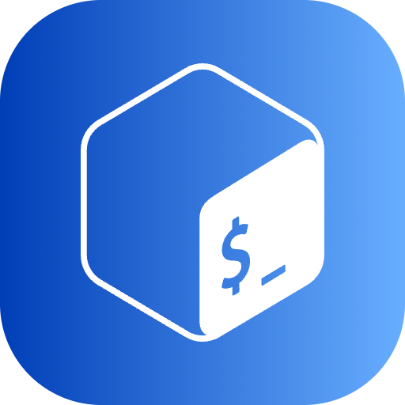

# Reverse Shell Generator

<div align="center">



A powerful Raycast extension for quickly generating various reverse shell commands.

[](https://www.raycast.com/)
[](LICENSE)

</div>

## ✨ Features

- 🚀 **40+ Shell Types** - Support for multiple programming languages and tools
- 🎯 **Smart Categorization** - Grouped by tool type, programming language, and operating system
- 🔍 **OS Filtering** - Quickly filter commands compatible with Linux, Windows, macOS
- 📋 **One-Click Copy** - Support for raw commands, URL encoding, Base64 encoding
- 💾 **Configuration Persistence** - Automatically save last used IP and port
- 📝 **Listener Commands** - Provides corresponding listener setup commands
- 💿 **Export Functionality** - Save commands as script files
- 🎨 **Detailed Preview** - View command details, descriptions, and usage instructions

## Supported Shell Types

### Shell Tools

- Bash (TCP/UDP/Exec/196)
- Netcat (Standard/FIFO/OpenBSD)
- Ncat
- Socat
- Telnet

### Scripting Languages

- Python (2/3/Shortest/Windows)
- PHP (exec/system/passthru/shell_exec)
- Perl
- Ruby
- Node.js
- Lua
- Awk

### Compiled Languages

- Golang
- Rust
- Java

### Windows

- PowerShell (#1/#2/Base64)
- C# TCP Client

### MSFVenom Payloads

- Linux (x64/x86)
- Windows (x64/x86)
- macOS

### Install from Raycast Store

search "reverse-shell-generator" in the Raycast Store

## 🎯 Usage

1. Open the extension in Raycast (shortcut: `⌘ + Space`)
2. Type "Generate Reverse Shell"
3. Enter target IP address and port
4. Browse and select the desired shell type
5. Use keyboard shortcuts for quick actions:
   - `⌘ + C` - Copy command
   - `⌘ + ⇧ + U` - Copy URL encoded
   - `⌘ + ⇧ + B` - Copy Base64 encoded
   - `⌘ + ⇧ + L` - Copy listener command
   - `⌘ + S` - Save to file
   - `⌘ + R` - Re-enter IP/port

## 🔍 Feature Showcase

### OS Filtering

Use the dropdown menu to quickly filter shells for specific operating systems:

- 🐧 Linux
- 🪟 Windows
- 🍎 macOS

### Encoding Options

Support for multiple encoding formats to bypass filters:

- Raw command
- URL encoding
- Base64 encoding

### Sorting Options

Sort commands by different dimensions:

- `⌘ + ⇧ + 1` - Sort by category
- `⌘ + ⇧ + 2` - Sort by name
- `⌘ + ⇧ + 3` - Sort by OS

## ⚠️ Security Warning

> **Important**: This tool is for authorized security testing and educational purposes only.

- ✅ **Legitimate Use Cases**:
  - Authorized penetration testing
  - CTF competitions
  - Security research and learning
  - Red team exercises

- ❌ **Prohibited Use Cases**:
  - Unauthorized system access
  - Malicious attacks
  - Illegal intrusion

**Users are solely responsible for any legal consequences arising from the use of this tool.**

## 🛠️ Tech Stack

- [Raycast API](https://developers.raycast.com/) - Extension framework
- [React](https://reactjs.org/) - UI components
- [TypeScript](https://www.typescriptlang.org/) - Type safety
- [Bun](https://bun.sh/) - Package management and build tool

## 📝 Development

### Project Structure

```
reverse-shell-generator/
├── src/
│   └── generate-reverse-shell.tsx  # Main logic
├── assets/
│   └── extension-icon.png          # Extension icon
├── package.json                     # Project configuration
├── tsconfig.json                    # TypeScript configuration
└── README.md                        # Project documentation
```

### Running Linting

```bash
bun run lint
bun run fix-lint
```

### Building

```bash
bun run build
```

### CI Validation

This repository includes a GitHub Actions workflow that automatically runs:

- `bun run test`
- `bun run lint`
- `bun run build`

for every pull request and for pushes to `main` and `ext/**`.

### Update Store Screenshots

Use the local one-command workflow when you want to refresh the Raycast Store screenshots:

```bash
bun run screenshots:update
```

What it does:

1. Backs up the current screenshots from `metadata/` into `metadata/backups/<timestamp>/`
2. Waits for you to update the screenshots with Raycast's official `Window Capture` + `Save to Metadata`
3. Detects which screenshots changed
4. Runs `test`, `lint`, and `build` automatically

Recommended flow:

1. Run `bun run screenshots:update`
2. In Raycast, open the extension in development mode
3. Use `Window Capture`
4. Enable `Save to Metadata`
5. Replace the store screenshots, then return to the terminal and press Enter

The backup folder is ignored by Git, so you can keep local screenshot history without polluting commits.

### Publishing

```bash
bun run publish
```

## 🤝 Contributing

Issues and Pull Requests are welcome!

1. Fork this repository
2. Create a feature branch (`git checkout -b feature/AmazingFeature`)
3. Commit your changes (`git commit -m 'Add some AmazingFeature'`)
4. Push to the branch (`git push origin feature/AmazingFeature`)
5. Open a Pull Request

## 📄 License

This project is licensed under the MIT License - see the [LICENSE](LICENSE) file for details.

## 🙏 Acknowledgments

- Inspired by [RevShells.com](https://www.revshells.com/)
- Thanks to [Raycast](https://www.raycast.com/) for providing an excellent platform

## 📮 Contact

For questions or suggestions, please contact us through:

- Submit an [Issue](https://github.com/raycast/extensions/issues)

---

<div align="center">
Made with ❤️ for the Security Community
</div>
